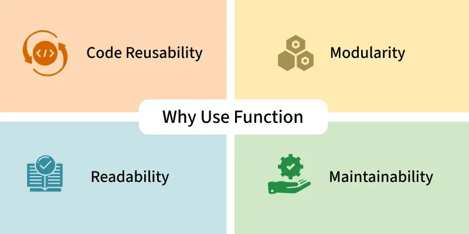

# Function
Functions are a block of statements that does a specific task. The idea is to put some commonly or repeatedly done task together and make a function so that instead of writing the same code again and again for different inputs, we can do the function calls to reuse code contained in it over and over again.


## Defining a Function
We can define a function in Python, using the `def` keyword. A function might take input in the form of parameters.

The syntax to declare a function is:


###### Here, we define a function using def that prints a welcome message when called.
```python
def fun():
    print("Welcome to GFG")
```
## Calling a Function
After creating a function in Python we can call it by using the name of the functions followed by parenthesis containing parameters of that particular function.
```python
def fun():
    print("Welcome to GFG")
    
fun() # Driver code to call a function
```
Output
Welcome to GFG

## Function Arguments
Arguments are the values passed inside the parenthesis of the function. A function can have any number of arguments separated by a comma.

**Syntax:**
```python
def function_name(parameters):
    """Docstring"""
    # body of the function
    return expression
```

We will create a simple function in Python to check whether the number passed as an argument to the function is even or odd.
```python
def evenOdd(x):
    if (x % 2 == 0):
        return "Even"
    else:
        return "Odd"

print(evenOdd(16))
print(evenOdd(7))
```
Output
Even
Odd

## Types of Function Arguments
Python supports various types of arguments that can be passed at the time of the function call. In Python, we have the following function argument types in Python, Let's explore them one by one.

### 1. Default Arguments
A default argument is a parameter that assumes a default value if a value is not provided in the function call for that argument.
```python
def myFun(x, y=50):
    print("x: ", x)
    print("y: ", y)
myFun(10)
```

Output
x:  10
y:  50


