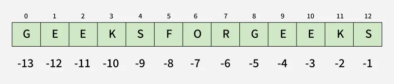

# Strings
* A string is a sequence of characters enclosed in quotes. It can include letters, numbers, symbols or spaces. Since Python has no separate character type, even a single character is treated as a string with length one. Strings are widely used for text handling and manipulation.

## Creating a String
* Strings can be created using either single ('...') or double ("...") quotes. Both behave the same.

Example: Creating two equivalent strings one with single and other with double quotes.
```python
s1 = 'Hello!!!'  # single quote
s2 = "Hello!!!"  # double quote
print(s1)
print(s2)
```
## Multi-line Strings
- Use triple quotes ('''...''' ) or ( """...""") for strings that span multiple lines. Newlines are preserved.

Example: Define and print multi-line strings using both styles.

```python
s = """I am Learning
Python String on GeeksforGeeks"""
print(s)

s = '''I'm a 
Geek'''
print(s)
```
## Accessing characters in String
- Strings are indexed sequences. Positive indices start at 0 from the left; negative indices start at -1 from the right as represented in below image:


Example 1: Access specific characters through positive indexing.
```python
s = "GeeksforGeeks"
print(s[0])   # first character
print(s[4])   # 5th character
```
**Note: Accessing an index out of range will cause an IndexError. Only integers are allowed as indices and using a float or other types will result in a TypeError.** 

Example 2: Read characters from the end using negative indices.
```python
s = "GeeksforGeeks"
print(s[-10])   # 3rd character
print(s[-5])    # 5th character from end
```

## String Slicing
- Slicing is a way to extract a portion of a string by specifying the start and end indexes. The syntax for slicing is ***string[start:end]***, where **start** starting index and **end** is stopping index (excluded).


Example: In this example we are slicing through range and reversing a string.
```python
s = "GeeksforGeeks"
print(s[1:4])    # characters from index 1 to 3
print(s[:3])     # from start to index 2
print(s[3:])     # from index 3 to end
print(s[::-1])   # reverse string
```

Output
eek
Gee
ksforGeeks
skeeGrofskeeG


## String Iteration
Strings are iterable; you can loop through characters one by one.

Example: Here, it print each character on its own line.
```python
s = "Python"
for char in s:
    print(char)
```
Output
P
y
t
h
o
n

## String Immutability
- Strings are immutable, which means that they cannot be changed after they are created. If we need to manipulate strings then we can use methods like concatenation, slicing or formatting to create new strings based on original.

Example: In this example we are changing first character by building a new string.
```python
s = "geeksforGeeks"
s = "G" + s[1:]   # create new string
print(s)
```
Output
GeeksforGeeks

## Deleting a String
- In Python, it is not possible to delete individual characters from a string since strings are immutable. However, we can delete an entire string variable using the del keyword.

Example: Here, we are using del keyword to delete a string.
```python
s = "GfG"
del s
```

***Note: After deleting the string if we try to access s then it will result in a NameError because variable no longer exists.***

## Updating a String
- As strings are immutable, “updates” create new strings using slicing or methods such as replace().

Example: This code fix the first letter and replace a word.
```python
s = "hello geeks"
s1 = "H" + s[1:]                   # update first character
s2 = s.replace("geeks", "GeeksforGeeks")  # replace word
print(s1)
print(s2)
```
Output
Hello geeks
hello GeeksforGeeks

Explanation:
s1: slice from index 1 onward and prepend "H".
s2: replace("geeks", "GeeksforGeeks") returns a new string.

## Common String Methods
- Python provides various built-in methods to manipulate strings. Below are some of the most useful methods:

1. *len()* : The len() function returns the total number of characters in a string (including spaces and punctuation).

Example:
```python
s = "GeeksforGeeks"
print(len(s))
```
Output
13

2. *upper() and lower()* : upper() method converts all characters to uppercase whereas, lower() method converts all characters to lowercase.

Example:
```python
s = "Hello World"
print(s.upper())
print(s.lower())
```
Output
HELLO WORLD
hello world

3. *strip() and replace()* : strip() removes leading and trailing whitespace from the string and replace() replaces all occurrences of a specified substring with another.

Example:
```python
s = "   Gfg   "
print(s.strip())    

s = "Python is fun"
print(s.replace("fun", "awesome"))
```
Output
Gfg
Python is awesome

## Python String Methods
- Python string methods is a collection of in-built Python functions that operates on strings.

**Note: Every string method in Python does not change the original string instead returns a new string with the changed attributes.** 

Python string is a sequence of Unicode characters that is enclosed in quotation marks. In this article, we will discuss the in-built string functions i.e. the functions provided by Python to operate on strings.

### Case Changing of Python String Methods
The below Python functions are used to change the case of the strings. Let's look at some Python string methods with examples:

1. lower(): Converts all uppercase characters in a string into lowercase
2. upper(): Converts all lowercase characters in a string into uppercase
3. title(): Convert string to title case
4. swapcase(): Swap the cases of all characters in a string
5. capitalize(): Convert the first character of a string to uppercase

Example: Changing the case of Python String Methods
```python
# Python3 program to show the
# working of upper() function
text = 'geeKs For geEkS'

# upper() function to convert
# string to upper case
print("\nConverted String:")
print(text.upper())

# lower() function to convert
# string to lower case
print("\nConverted String:")
print(text.lower())

# converts the first character to 
# upper case and rest to lower case 
print("\nConverted String:")
print(text.title())

# swaps the case of all characters in the string
# upper case character to lowercase and viceversa
print("\nConverted String:")
print(text.swapcase())

# convert the first character of a string to uppercase
print("\nConverted String:")
print(text.capitalize())

# original string never changes
print("\nOriginal String")
print(text)
```
Output
Converted String:
GEEKS FOR GEEKS

Converted String:
geeks for geeks

Converted String:
Geeks For Geeks

Converted String:
GEEkS fOR GEeKs

Original String
geeKs For geEkS


### List of String Methods in Python

| Function Name | Description |
|---------------|-------------|
| capitalize() | Converts the first character of the string to uppercase |
| casefold() | Implements caseless string matching (aggressive lowercase conversion) |
| center() | Pads the string with the specified character to make it centered |
| count() | Returns the number of occurrences of a substring |
| encode() | Encodes the string using the specified encoding scheme |
| endswith() | Returns True if the string ends with the given suffix |
| expandtabs() | Replaces tab characters `\t` with specified number of spaces |
| find() | Returns the lowest index of the substring if found |
| format() | Formats the string for printing |
| format_map() | Formats specified values in a string using a dictionary |
| index() | Returns the position of the first occurrence of a substring (raises error if not found) |
| isalnum() | Returns True if all characters are alphanumeric |
| isalpha() | Returns True if all characters are alphabets |
| isdecimal() | Returns True if all characters are decimal characters |
| isdigit() | Returns True if all characters are digits |
| isidentifier() | Returns True if the string is a valid Python identifier |
| islower() | Returns True if all characters are lowercase |
| isnumeric() | Returns True if all characters are numeric |
| isprintable() | Returns True if all characters are printable or string is empty |
| isspace() | Returns True if all characters are whitespace |
| istitle() | Returns True if the string follows title case rules |
| isupper() | Returns True if all characters are uppercase |
| join() | Concatenates elements of an iterable into a string |
| ljust() | Left-aligns the string within a given width |
| lower() | Converts all characters to lowercase |
| lstrip() | Removes leading characters |
| maketrans() | Returns a translation table for translate() |
| partition() | Splits string at the first occurrence of the separator |
| replace() | Replaces all occurrences of a substring |
| rfind() | Returns the highest index of the substring |
| rindex() | Returns the highest index of the substring (raises error if not found) |
| rjust() | Right-aligns the string within a given width |
| rpartition() | Splits string into three parts using the last occurrence of the separator |
| rsplit() | Splits string from the right by the specified separator |
| rstrip() | Removes trailing characters |
| splitlines() | Splits the string at line boundaries |
| startswith() | Returns True if the string starts with the given prefix |
| strip() | Removes both leading and trailing characters |
| swapcase() | Swaps case of all characters |
| title() | Converts string to title case |
| translate() | Modifies string using a translation table |
| upper() | Converts all characters to uppercase |
| zfill() | Pads the left side of the string with zeros |


## Concatenating and Repeating Strings
We can concatenate strings using + operator and repeat them using * operator.

1. Strings can be combined by using + operator.

Example: Join two words with a space.
```python
s1 = "Hello"
s2 = "World"
print(s1 + " " + s2)
```
Output
Hello World

2. We can repeat a string multiple times using * operator.

Example: Repeat a greeting three times.
```python
s = "Hello "
print(s * 3)
```
Output
Hello Hello Hello

## Formatting Strings
Python provides several ways to include variables inside strings.

1. Using f-strings
The simplest and most preferred way to format strings is by using f-strings.

Example: Embed variables directly using {} placeholders.
```python
name = "Alice"
age = 22
print(f"Name: {name}, Age: {age}")
```
Output
Name: Alice, Age: 22

2. Using format()
Another way to format strings is by using format() method.

Example: Use placeholders {} and pass values positionally.
```python
s = "My name is {} and I am {} years old.".format("Alice", 22)
print(s)
```
Output
My name is Alice and I am 22 years old.

## String Membership Testing
In **keyword** checks if a particular substring is present in a string.

Example: Here, we are testing for the presence of substrings.
```python
s = "GeeksforGeeks"
print("Geeks" in s)
print("GfG" in s)
```
Output
True
False

