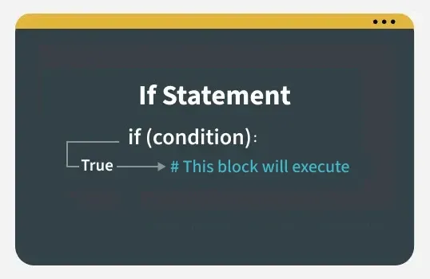
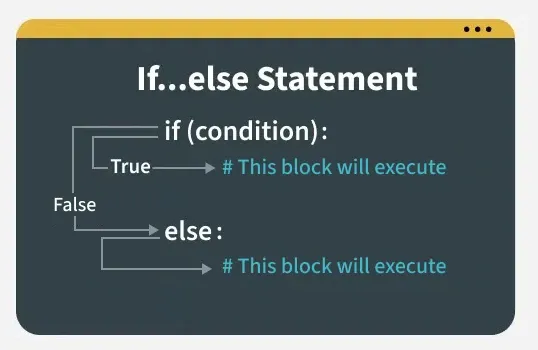
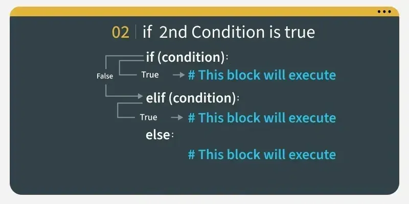
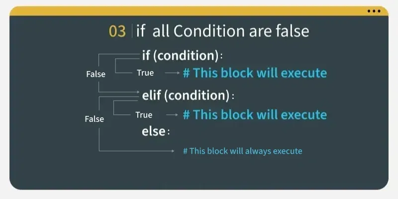

# Conditional Statements
- Conditional statements in Python are used to execute certain blocks of code based on specific conditions. These statements help control the flow of a program, making it behave differently in different situations.

## If Conditional Statement
If statement is the simplest form of a conditional statement. It executes a block of code if the given condition is true.


```python
age = 20
if age >= 18:
    print("Eligible to vote.")
```
Output
Eligible to vote.

### Short Hand if
Short-hand if statement allows us to write a single-line if statement.
```python
age = 19
if age > 18: print("Eligible to Vote.")
```
Output
Eligible to Vote.

## If else Conditional Statement
**If Else** allows us to specify a block of code that will execute if the condition(s) associated with an if or elif statement evaluates to False. Else block provides a way to handle all other cases that don't meet the specified conditions.

```python
age = 10
if age <= 12:
    print("Travel for free.")
else:
    print("Pay for ticket.")
```
Output
Travel for free.

###Short Hand if-else
The short-hand if-else statement allows us to write a single-line if-else statement.
```python
marks = 45
res = "Pass" if marks >= 40 else "Fail"
print(f"Result: {res}")
```
Output
Result: Pass

***Note: This method is also known as ternary operator. Ternary Operator essentially a shorthand for the if-else statement that allows us to write more compact and readable code, especially for simple conditions.***

## elif Statement
**elif** statement in Python stands for "else if." It allows us to check multiple conditions, providing a way to execute different blocks of code based on which condition is true. Using elif statements makes our code more readable and efficient by eliminating the need for multiple nested if statements.



```python
age = 25

if age <= 12:
    print("Child.")
elif age <= 19:
    print("Teenager.")
elif age <= 35:
    print("Young adult.")
else:
    print("Adult.")
```
Output
Young adult.

The code checks the value of age using if-elif-else. Since age is 25, it skips the first two conditions (age <= 12 and age <= 19), and the third condition (age <= 35) is True, so it prints "Young adult.".


## Nested if..else Conditional Statement
***Nested if..else*** means an if-else statement inside another if statement. We can use nested if statements to check conditions within conditions.

```python
age = 70
is_member = True

if age >= 60:
    if is_member:
        print("30% senior discount!")
    else:
        print("20% senior discount.")
else:
    print("Not eligible for a senior discount.")
```
Output
30% senior discount!

## Ternary Conditional Statement
A ternary conditional statement is a compact way to write an if-else condition in a single line. It’s sometimes called a "conditional expression."
```python
# Assign a value based on a condition
age = 20
s = "Adult" if age >= 18 else "Minor"
print(s)
```
Output
Adult

Here:
If age >= 18 is True, status is assigned "Adult".
Otherwise, status is assigned "Minor".

## Match-Case Statement
match-case statement is Python's version of a switch-case found in other languages. It allows us to match a variable's value against a set of patterns.
```python number = 2

match number:
    case 1:
        print("One")
    case 2 | 3:
        print("Two or Three")
    case _:
        print("Other number")
```
Output:
Two or Three


