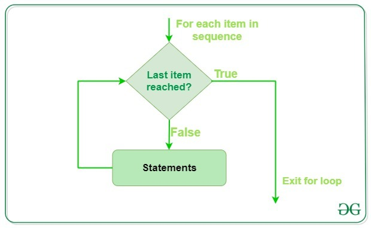
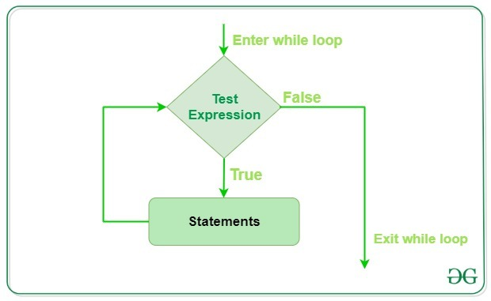

# Loops
- Loops in Python are used to repeat actions efficiently. The main types are For loops (counting through items) and While loops (based on conditions).

## For Loop
* For loops is used to iterate over a sequence such as a list, tuple, string or range. It allow to execute a block of code repeatedly, once for each item in the sequence.
```python
n = 4
for i in range(0, n):
    print(i)
```
Output
0
1
2
3

Explanation: This code prints the numbers from 0 to 3 (inclusive) using a for loop that iterates over a range from 0 to n-1 (where n = 4).


Example:
Iterating Over List, Tuple, String and Dictionary Using for Loops in Python
```python
li = ["geeks", "for", "geeks"]
for x in li:
    print(x)
    
tup = ("geeks", "for", "geeks")
for x in tup:
    print(x)
    
s = "abc"
for x in s:
    print(x)
    
d = dict({'x':123, 'y':354})
for x in d:
    print("%s  %d" % (x, d[x]))
    
set1 = {10, 30, 20}
for x in set1:
    print(x),
```
Output
geeks
for
geeks
geeks
for
geeks
a
b
c
x  123
y  354
10
20
30


## Iterating by Index of Sequences
We can also use the index of elements in the sequence to iterate. The key idea is to first calculate the length of the list and then iterate over the sequence within the range of this length.
```python
li = ["geeks", "for", "geeks"]
for index in range(len(li)):
    print(li[index])
```
Output
geeks
for
geeks

Explanation: This code iterates through each element of the list using its index and prints each element one by one. The range(len(list)) generates indices from 0 to the length of the list minus 1.

### Looping Through a String
Even strings are iterable objects, they contain a sequence of characters:
```python
for x in "banana":
  print(x)
```
Output
b
a
n
a
n
a

### The break Statement
With the break statement we can stop the loop before it has looped through all the items:

Example:
Exit the loop when x is "banana":
```python
fruits = ["apple", "banana", "cherry"]
for x in fruits:
  print(x)
  if x == "banana":
    break
```
Output
apple
banana


Example:
Exit the loop when x is "banana", but this time the break comes before the print:
```python
fruits = ["apple", "banana", "cherry"]
for x in fruits:
  if x == "banana":
    break
  print(x)
```
Output
apple

### The continue Statement
With the continue statement we can stop the current iteration of the loop, and continue with the next:

Example
Do not print banana:
```python
fruits = ["apple", "banana", "cherry"]
for x in fruits:
  if x == "banana":
    continue
  print(x)
```

## The range() Function
- To loop through a set of code a specified number of times, we can use the `range()` function,

- The `range()` function returns a sequence of numbers, starting from 0 by default, and increments by 1 (by default), and ends at a specified number.

Example
Using the range() function:
```python
for x in range(6):
  print(x)
```
Output
0
1
2
3
4
5

***Note that range(6) is not the values of 0 to 6, but the values 0 to 5.***

**The range() function defaults to 0 as a starting value, however it is possible to specify the starting value by adding a parameter: range(2, 6), which means values from 2 to 6 (but not including 6):**

Example
Using the start parameter:
```python
for x in range(2, 6):
  print(x)
```
Output
2
3
4
5

- ***The `range()` function defaults to increment the sequence by 1, however it is possible to specify the increment value by adding a third parameter: range(2, 30, 3):***

Example:
Increment the sequence with 3 (default is 1):
```python
for x in range(2, 30, 3):
  print(x)
```
Output
2
5
8
11
14
17
20
23
26
29

## Else in For Loop
The `else` keyword in a `for` loop specifies a block of code to be executed when the loop is finished:

Example
Print all numbers from 0 to 5, and print a message when the loop has ended:
```python
for x in range(6):
  print(x)
else:
  print("Finally finished!")
```
Output
0
1
2
3
4
5
Finally finished!

***Note: The `else` block will NOT be executed if the loop is stopped by a `break` statement.***

Example
Break the loop when x is 3, and see what happens with the else block:
```python
for x in range(6):
  if x == 3: break
  print(x)
else:
  print("Finally finished!")
```
Output
0
1
2

## Nested Loops
- A nested loop is a loop inside a loop.

- The "inner loop" will be executed one time for each iteration of the "outer loop":

Example
Print each adjective for every fruit:
```python
adj = ["red", "big", "tasty"]
fruits = ["apple", "banana", "cherry"]

for x in adj:
  for y in fruits:
    print(x, y)
```
Output
red apple
red banana
red cherry
big apple
big banana
big cherry
tasty apple
tasty banana
tasty cherry

## The pass Statement
- `for` loops cannot be empty, but if you for some reason have a `for` loop with no content, put in the `pass` statement to avoid getting an error.

Example:
```python
for x in [0, 1, 2]:
  pass
# having an empty for loop like this, would raise an error without the pass statement
```

## While Loop
In Python, a `while loop` is used to execute a block of statements repeatedly until a given condition is satisfied. When the condition becomes false, the line immediately after the loop in the program is executed.

In below code, loop runs as long as the condition cnt < 3 is true. It increments the counter by 1 on each iteration and prints "Hello Geek" three times
```python
cnt = 0
while (cnt < 3):
    cnt = cnt + 1
    print("Hello Geek")
```
Output
Hello Geek
Hello Geek
Hello Geek


## Infinite While Loop
If we want a block of code to execute infinite number of times then we can use the while loop in Python to do so.

Code given below uses a 'while' loop with the condition "True", which means that the loop will run infinitely until we break out of it using "break" keyword or some other logic.
```python
while (True):
    print("Hello Geek")
```
***Note: It is suggested not to use this type of loop as it is a never-ending infinite loop where the condition is always true and we have to forcefully terminate the compiler.***


## Loop Control Statements
Loop control statements change execution from their normal sequence. When execution leaves a scope, all automatic objects that were created in that scope are destroyed. Python supports the following control statements